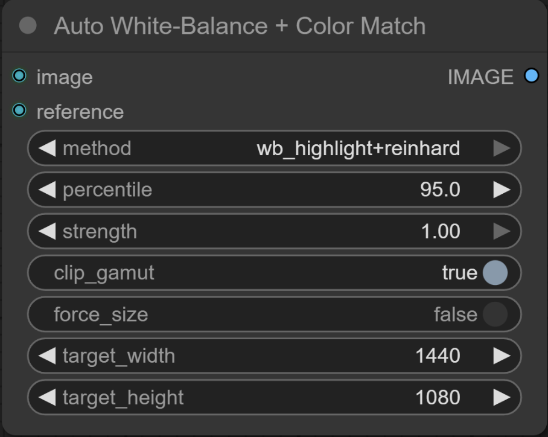
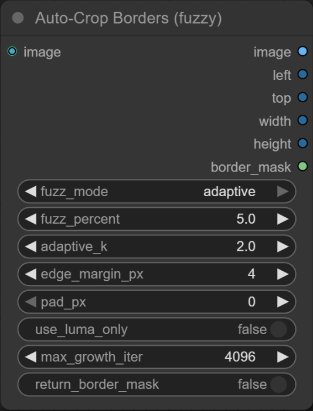
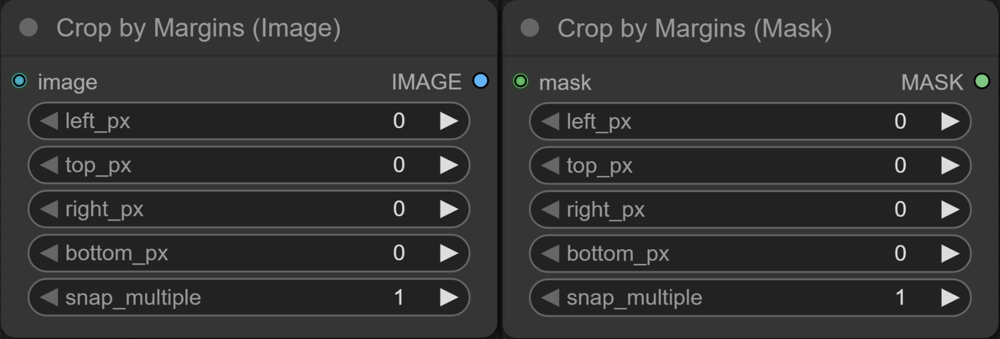
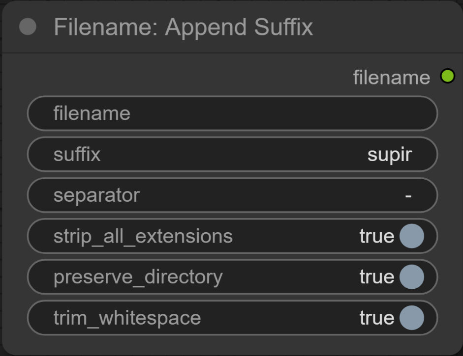
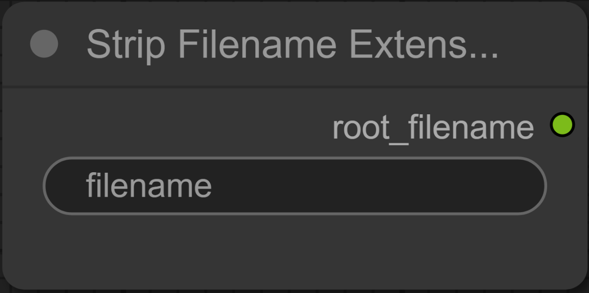
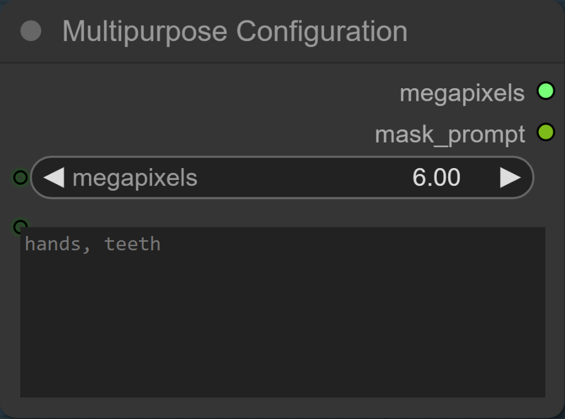

Utility nodes for ComfyUI. Created solely for my own use case, shared as a courtesy only, no support provided. I hope you find them useful, but you're on your own.

## 🛠️ Installation

cd /path/to/ComfyUI/custom_nodes  
git clone https://github.com/heyburns/LinxUtil.git  
Restart ComfyUI and refresh the browser  

---

# 📚 Node Catalog

---

## Levels Match (Reference)

  

Match black/white points (and optional midtone) of an image to a **reference** using percentile clipping. Choose fast **linear** mapping or smoother **CDF** mapping.

**Category:** `Image/Color` • **Display name:** **Levels Match**

**Inputs**  
- `image` (IMAGE) — to adjust  
- `reference` (IMAGE) — target look

**Parameters**

| Name | Type | Default | Notes |
|---|---|---:|---|
| `method` | enum(`linear`,`cdf`) | `linear` | Mapping style: linear is fast; CDF is smoother on tricky histograms. |
| `per_channel` | BOOL | `True` | Match each RGB channel; set `False` to match luminance only. |
| `low_clip` | FLOAT | `0.5` | Ignore darkest `low_clip%` as outliers. |
| `high_clip` | FLOAT | `99.5` | Ignore brightest `high_clip%` as outliers. |
| `use_gamma` | BOOL | `True` | If on, match a midtone (gamma). |
| `mid_percentile` | FLOAT | `50.0` | Percentile used for midtone when `use_gamma=True`. |

**Output**  
- `image` (IMAGE) — level-matched

**Tips:** Start with `linear`, `per_channel=True`, `low_clip=0.5`, `high_clip=99.5`. If color shifts feel heavy, turn `per_channel` off.

---

## Auto White-Balance + Color Match

  

Fast, reference-driven color normalization. Apply auto white balance, then (optionally) match overall look to a reference via Reinhard Lab transfer.

**Category:** `Image/Color` • **Display name:** **Auto White-Balance + Color Match**

**Inputs**  
- `image` (IMAGE) — source  
- `reference` (IMAGE) — only used by match modes

**Parameters**

| Name | Type | Default | Notes |
|---|---|---:|---|
| `method` | enum(`wb_grayworld`,`wb_highlight`,`reinhard_lab`,`lab_l_only`,`wb_highlight+reinhard`) | `wb_highlight+reinhard` | Pipeline choice; the default does highlight WB then Lab match. |
| `percentile` | FLOAT | `95.0` | For `wb_highlight`; sets “white-patch” luminance threshold. |
| `strength` | FLOAT | `1.0` | Blend 0–1 of correction into original. |
| `clip_gamut` | BOOL | `True` | Clamp final result to `[0,1]` to avoid overs. |
| `force_size` | BOOL | `True` | Analyze at target size for speed; apply at full res. |
| `target_width/height` | INT | `1440/1080` | Analysis size when `force_size=True`. |

**Output**  
- `image` (IMAGE) — corrected/matched

**Tips:** Start with `wb_highlight+reinhard`, `percentile=95–98`, `strength=0.7–1.0`. Use `lab_l_only` if you want brightness/contrast aligned without hue shifts.

---

## Auto-Crop Borders (fuzzy)

  

Smartly trims uniform borders using an edge-seeded, fuzzy-threshold region growth. Returns the cropped image, the crop box, and an optional border mask.

**Category:** `Image/Transform` • **Display name:** **Auto-Crop Borders**

**Inputs**  
- `image` (IMAGE)

**Parameters**

| Name | Type | Default | Notes |
|---|---|---:|---|
| `fuzz_mode` | enum(`percent`,`adaptive`) | `adaptive` | `%` = fixed tolerance; `adaptive` = k·σ near edges. |
| `fuzz_percent` | FLOAT | `5.0` | Used when `fuzz_mode=percent`. Higher = more tolerant. |
| `adaptive_k` | FLOAT | `2.0` | Used when `fuzz_mode=adaptive`. Raise if borders vary. |
| `edge_margin_px` | INT | `4` | Edge strip width sampled for border color(s). |
| `pad_px` | INT | `0` | Expand final crop by N pixels on all sides. |
| `use_luma_only` | BOOL | `False` | Detect borders using luminance only. |
| `max_growth_iter` | INT | `4096` | Safety cap on region growth. |
| `return_border_mask` | BOOL | `False` | Emit a binary mask of removed borders. |

**Outputs**  
- `image` (IMAGE) — cropped  
- `left` (INT), `top` (INT), `width` (INT), `height` (INT) — crop box  
- `border_mask` (MASK) — if enabled

**Tips:** If tiny halos remain, add `pad_px=1–3`. For colored borders, keep `use_luma_only=False`.

---

## Crop by Margins (Image & Mask)

  

Precisely removes margins from an **image** or a **mask**, with optional snapping to a multiple (useful for model constraints).

**Categories:** `Image/Transform`, `Mask/Transform` • **Display names:** **Crop Image by Margins**, **Crop Mask by Margins**

**Inputs**  
- `image` (IMAGE) **or** `mask` (MASK)

**Parameters**

| Name | Type | Default | Notes |
|---|---|---:|---|
| `left_px` | INT | `0` | Pixels to remove on the left. |
| `top_px` | INT | `0` | Pixels to remove on the top. |
| `right_px` | INT | `0` | Pixels to remove on the right. |
| `bottom_px` | INT | `0` | Pixels to remove on the bottom. |
| `snap_multiple` | INT | `1` | Round W/H to nearest multiple; `1` disables snapping. |

**Outputs**  
- `IMAGE` (image variant) or `MASK` (mask variant)

**Tip:** Set `snap_multiple=64` to keep sizes compatible with common diffusion models.

---

## Stitch by Mask (Feathered)

  

Composite `image_b` over `image_a` using a real `mask`, with optional invert, opacity, and feathering. Can process at a reduced size for speed, then apply at full res.

**Category:** `Image/Composite` • **Display name:** **Stitch by Mask (Feathered)**

**Inputs**  
- `image_a` (IMAGE), `image_b` (IMAGE), `mask` (MASK)

**Parameters**

| Name | Type | Default | Notes |
|---|---|---:|---|
| `invert_mask` | BOOL | `False` | Treat black↔white inverted. |
| `opacity` | FLOAT | `1.0` | Blend factor for `image_b` (0–1). |
| `feather_radius` | INT | `5` | Edge softening radius (px). |
| `force_size` | BOOL | `True` | Downscale for mask ops; re-apply full res. |
| `target_width/height` | INT | `1440/1080` | Size used when `force_size=True`. |

**Outputs**  
- `stitched` (IMAGE) — composite  
- `processed_mask` (MASK) — after invert/feather/resize

**Tips:** For subtle seams, `feather_radius=3–8`, `opacity≈0.8–1.0`. If sources differ in size, leave `force_size=True`.

---

## Filename: Append Suffix

  

Strip extension(s) and append a suffix (e.g., `001.jpg` + `-supir` → `001-supir`). Preserve directory paths if desired; handles compound extensions.

**Category:** `Utils/IO` • **Display name:** **Filename: Append Suffix**

**Input**  
- `filename` (STRING)

**Parameters**

| Name | Type | Default | Notes |
|---|---|---:|---|
| `suffix` | STRING | `supir` | Text appended to the base name. |
| `separator` | STRING | `-` | Placed between base and suffix. |
| `strip_all_extensions` | BOOL | `True` | Peel compound extensions (e.g., `.tar.gz`). |
| `preserve_directory` | BOOL | `True` | Keep original path; `False` returns just the name. |
| `trim_whitespace` | BOOL | `True` | Trim spaces before assembling the result. |

**Output**  
- `filename` (STRING) — new path/name

---

## Strip Filename Extension

  

Removes the final extension from a filename string (`photo.png` → `photo`). Simple, robust, cross-platform.

**Category:** `Utils/IO` • **Display name:** **Strip Filename Extension**

**Input**  
- `filename` (STRING)

**Output**  
- `root_filename` (STRING)

**Tip:** For compound extensions, pair with **Filename: Append Suffix** (set that node to strip all extensions).

---

## Multipurpose Configuration

  

Small “source/utility” node that owns a couple of configuration values you can reuse elsewhere (handy in compact graphs).

**Category:** `Utility/Configuration` • **Display name:** **Multipurpose Configuration**

**Parameters**

| Name | Type | Default | Notes |
|---|---|---:|---|
| `megapixels` | FLOAT | `2.0` | Emits a `FLOAT` (e.g., for resizers that accept MP as float). |
| `mask_prompt` | STRING | `""` | Multiline free-text. |

**Outputs**  
- `megapixels` (FLOAT)  
- `mask_prompt` (STRING)

---

## 🔄 Updating

    cd LinxUtil
    git pull
    # Restart ComfyUI

---

## 🧭 Repo Layout (for contributors)

    LinxUtil/
    ├─ __init__.py                  # Exports NODE_CLASS_MAPPINGS for ComfyUI
    ├─ linxutil/
    │  ├─ __init__.py
    │  ├─ auto_color_match.py
    │  ├─ auto_crop_borders.py
    │  ├─ levels_match_node.py
    │  ├─ crop_by_margins.py
    │  ├─ filename_append_suffix.py
    │  ├─ remove_extension.py
    │  └─ multipurpose_configuration.py
    └─ assets/
       ├─ auto_color_match.png
       ├─ auto_crop_borders.png
       ├─ levels_match.png
       ├─ crop_by_margins.png
       ├─ filename_append_suffix.png
       ├─ strip_extension.png
       └─ multipurpose_configuration.png

---

## 📄 License
MIT — see `LICENSE`.