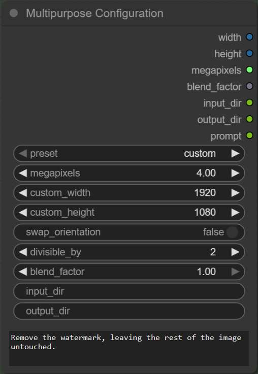

Utility nodes for ComfyUI. Created solely for my own use case, shared as a courtesy only.

## 🛠️ Installation

cd /path/to/ComfyUI/custom_nodes  
git clone https://github.com/heyburns/LinxUtil.git  
Restart ComfyUI and refresh the browser  

---

## ✨ Current Nodes

### 1) Multipurpose Configuration
A minimal utility node that exposes two *in-node* controls and emits their values as sockets:

- **Megapixels (FLOAT)** — set a target megapixel resolution value directly in the node (no external input required). Ideal for driving resizers that accept a `FLOAT` input.  
- **Mask Prompt (STRING)** — a multiline text field where you can type prompt text for masking/selection nodes that accept a `STRING`.

  

